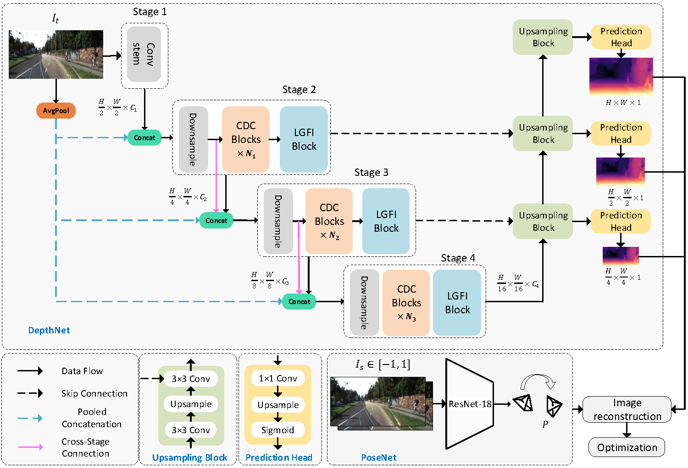
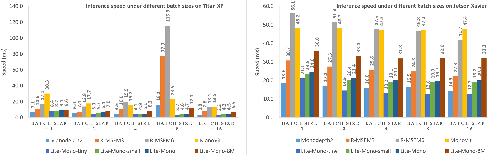
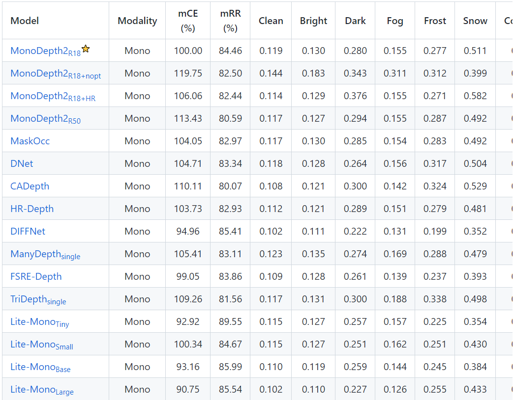

<div align="center">

# Toward Label-Free Lightweight Monocular Depth in Orchards

**In-domain self-distillation and an anatomy of domain shift — a label-free, RGB-only depth study, built on [Lite-Mono](https://github.com/noahzn/Lite-Mono) and validated on a citrus orchard.**

[](#license)


</div>

> **What this is.** A research fork of Lite-Mono that studies how to improve a lightweight,
> single-camera, *self-supervised* depth network for **vegetation-dense agricultural scenes**
> (validated on the **CitrusFarm** orchard dataset) — under two hard constraints: training stays
> **label-free / RGB-only**, and **inference is unchanged** (the same ~3M-parameter Lite-Mono runs
> on a single RGB image). Our method (**Snapshot 10**) is the first in this workstream to *beat* the
> original Lite-Mono on overall error while keeping threshold accuracy well above it — at **zero extra
> inference cost.**
>
> **New here?** Start with [`AGENTS.md`](AGENTS.md) (source of truth), then
> [`citrus_project/README.md`](citrus_project/README.md). The upstream Lite-Mono README is preserved
> at the [bottom of this file](#original-lite-mono-readme-preserved).

---

## Table of Contents
- [Highlights](#highlights)
- [Key result](#key-result)
- [Method at a glance](#method-at-a-glance)
- [Repository structure](#repository-structure)
- [The paper](#the-paper)
- [Getting started](#getting-started)
- [Reproducing the results](#reproducing-the-results)
- [Honest scope and limitations](#honest-scope-and-limitations)
- [Experiment lineage](#experiment-lineage)
- [Team](#team)
- [Acknowledgements](#acknowledgements)
- [License](#license)
- [Citation](#citation)
- [Original Lite-Mono README (preserved)](#original-lite-mono-readme-preserved)

---

## Highlights
- 🌳 **Domain.** Depth estimation in a citrus orchard (CitrusFarm), where repeated foliage, weak
  texture, wind, open clearings, and sky make standard (urban-trained) self-supervised depth struggle.
- 🧠 **Idea.** An **in-domain EMA self-teacher**: a slowly-updated exponential-moving-average copy of
  the student model — which learns the orchard as training proceeds — distills its predictions back
  into the student, using a **scale-and-shift-invariant (SI-log)** metric term plus a
  normalized-structure anchor.
- 🪶 **Free at inference.** The teacher and all training losses are discarded after training; the
  deployed model is the unmodified single-image, RGB-only, ~3M-parameter Lite-Mono.
- 🔬 **Honest by construction.** We report what did *not* work (a documented lineage of negative
  results), a diagnosed failure mode (the image-row→depth "ground-ramp" shortcut), and the fact that
  our reliability gates turned out near-inert — all tied to on-disk evaluation artifacts.

## Key result
CitrusFarm Sequence 01, test split, **median-scaled** metrics (training is label-free; LiDAR depth is
evaluation-only). Lower `abs_rel` is better; higher `δ` is better.

| Method | `abs_rel` ↓ | `δ₁` ↑ | `δ₂` ↑ | `δ₃` ↑ |
|---|:---:|:---:|:---:|:---:|
| Original Lite-Mono (baseline) | 0.3836 | 0.4989 | 0.7264 | 0.8700 |
| S07 (previous best, structure-aware) | 0.3840 | **0.6539** | 0.8407 | 0.9105 |
| **S10 — in-domain EMA self-teacher (ours)** | **0.3080** | 0.6258 | 0.8118 | 0.9005 |

**S10 is the first method in our label-free line to beat the original Lite-Mono on `abs_rel`**
(0.3080 vs 0.3836, ≈20% relative) while keeping `δ₁` far above it (0.6258 vs 0.4989, ≈25% relative).
Versus our previous best (S07) it wins `abs_rel` by a wide margin for a small, honestly-reported `δ₁`
give-back. The headline number was independently re-verified from the preserved checkpoint.

## Method at a glance
S10 = a structure-aware self-supervised stack (S07) **+ one training-only loss**: an EMA copy of the
student (no gradient) supplies a target depth, and the student is nudged to agree with it via

1. a **scale-and-shift-invariant SI-log** term — the part that actually moves median-scaled `abs_rel`
   (a purely normalized structure term is invisible to median scaling and can only *tie* it); and
2. a **normalized-structure anchor** — protects relative structure / threshold accuracy.

Two reliability gates (DC flip-consistency, GC min-reprojection) are designed to mask unreliable
pixels; in practice they were near-inert, so the gain comes from *near-dense* self-distillation
(reported transparently). The method diagram is at
[`.../paper/figures/fig_method.png`](citrus_project/milestones/04_lightweight_vegetation_improvement/levinson/paper/figures/fig_method.png).

## Repository structure
```
.
├── AGENTS.md              # Source of truth: project status, decisions, commands, paths
├── CLAUDE.md             # Read-order + working rules for contributors/assistants
├── README.md             # (this file)
├── train.py, trainer.py, options.py, evaluate_depth.py, test_simple.py
├── networks/, layers.py, kitti_utils.py, utils.py   # Lite-Mono model + training code
├── weights/lite-mono/    # Original Lite-Mono inference weights (baseline)
├── environment*.yml      # Conda environments
└── citrus_project/       # All project-owned research
    ├── README.md, TASK_BOARD.md, TEAM_WORKFLOW.md
    ├── dataset_workspace/   # Prepared CitrusFarm frames + eval labels (local, not tracked)
    ├── research/            # Notes, literature, paper-support material
    └── milestones/
        └── 04_lightweight_vegetation_improvement/levinson/
            ├── snapshots/   # S00–S11: design notes, code, checkpoints, results, diagnostics
            └── paper/       # The paper (LaTeX, figures, references)
```

## The paper
The write-up lives in
[`citrus_project/milestones/04_lightweight_vegetation_improvement/levinson/paper/`](citrus_project/milestones/04_lightweight_vegetation_improvement/levinson/paper/)
(IEEEtran two-column `main.tex`, `references.bib`, `figures/`). It frames S10 as the contribution and
the earlier snapshots (S01–S09, S11) as honest ablations / negative results. See the paper folder's
`README.md` for build instructions (uploads to any online LaTeX editor / Overleaf).

## Getting started
**Environment.** Create the conda environment and install the LR-scheduler dependency:
```bash
conda env create -f environment.yml      # or environment.cpu.yml / environment.macos.yml
pip install 'git+https://github.com/saadnaeem-dev/pytorch-linear-warmup-cosine-annealing-warm-restarts-weight-decay'
```
Development was done on a single 8 GB RTX 4060 (Windows / PowerShell), batch size 12, 640×192,
30 epochs (~24–28 h per full run). The original Lite-Mono usage (KITTI training/testing) is unchanged
and documented in the [preserved upstream README](#original-lite-mono-readme-preserved).

## Reproducing the results
Trained inference weights (`encoder.pth` + `depth.pth`) are committed for the key models:

| Model | Path |
|---|---|
| Original Lite-Mono | `weights/lite-mono/` |
| B0 (plain Citrus fine-tune) | `citrus_project/.../levinson/snapshots/00_plain_citrus_baseline/checkpoint/` |
| S07 (previous best) | `.../snapshots/07_structure_aware_label_free_vegetation_depth/checkpoint/` |
| **S10 (hero)** | `.../snapshots/10_ema_self_teacher/checkpoint/` |

Each snapshot folder carries its own `DESIGN_NOTE.md`, `results/`, `diagnostics/`, and the exact
flags/commands used. The S10 training flags are off-by-default (`--ema_self_distillation
--ema_filter_adaptive`). For the canonical evaluation protocol and current commands, see
[`AGENTS.md`](AGENTS.md) and the snapshot result summaries — the source of truth, kept in sync with
the code.

## Honest scope and limitations
- **Metrics, not visuals.** S10 improves accuracy; sky/far-canopy confusion and canopy over-smoothing
  remain visually unsolved.
- **Near-inert gates.** The DC/GC reliability gates kept ~88% of pixels throughout; the gain is from
  broad SI-log self-distillation, not selective gating (an ablation isolating the gates was not run).
- **Single domain.** All results are CitrusFarm Sequence 01; generalization is unverified.
- **Evaluation labels** are project-derived from LiDAR (projection + densification), not an official
  ground-truth product, and cover ~37% of pixels — used for evaluation only, never in training.

## Experiment lineage
A fixed training recipe is held across all snapshots so comparisons isolate the objective change:

| Stage | Mechanism (training-only, label-free) | Verdict |
|---|---|---|
| B0 | plain Citrus fine-tune | high `δ₁`, poor `abs_rel` |
| S01–S04 | confidence / edge / temporal cues | negative / weak gates |
| S05–S06 | teacher-anchored structure regularization | promising / marginal |
| S07 | structure-aware + sky/far prior | previous best |
| S08–S09 | feature-metric / boundary-uncertainty (sharpening) | negative |
| **S10** | **in-domain EMA self-teacher** | **best (hero)** |
| S11 | resizing-crop self-distillation | negative (flat-depth collapse) |

## Team
- **Carlene Amelya** — Yuan Ze University
- **Levinson** — Yuan Ze University *(label-free / self-supervised workstream — this result)*
- **Marvel Aiken** — Yuan Ze University *(supervised / hybrid workstream)*

## Acknowledgements
- **[Lite-Mono](https://github.com/noahzn/Lite-Mono)** (Zhang et al., CVPR 2023) — the backbone,
  baseline, and training code this project builds on.
- **[Monodepth2](https://github.com/nianticlabs/monodepth2)** (Godard et al., ICCV 2019) — the
  self-supervised photometric recipe.
- The **CitrusFarm** dataset authors for the orchard RGB + LiDAR data used as our validation domain.

## License
This project is released under the **MIT License**, consistent with upstream Lite-Mono. See
[`license`](license). Original Lite-Mono code and weights remain under their authors' terms; the
CitrusFarm dataset is governed by its own license.

## Citation
If you use this work, please cite both this project and Lite-Mono. *(This work is a research draft;
citation details are provisional.)*
```bibtex
@misc{citrus_litemono_selfteacher,
  title  = {Toward Label-Free Lightweight Monocular Depth in Orchards:
            In-Domain Self-Distillation and an Anatomy of Domain Shift},
  author = {Amelya, Carlene and Levinson and Aiken, Marvel},
  year   = {2026},
  note   = {Yuan Ze University; research draft}
}
```
```bibtex
@InProceedings{Zhang_2023_CVPR,
  author    = {Zhang, Ning and Nex, Francesco and Vosselman, George and Kerle, Norman},
  title     = {Lite-Mono: A Lightweight CNN and Transformer Architecture for Self-Supervised Monocular Depth Estimation},
  booktitle = {Proceedings of the IEEE/CVF Conference on Computer Vision and Pattern Recognition (CVPR)},
  month     = {June},
  year      = {2023},
  pages     = {18537-18546}
}
```

---
---

# Original Lite-Mono README (preserved)

> The content below is the upstream Lite-Mono README, preserved verbatim for original model usage and
> citation context. It refers to the original KITTI models and workflow, **not** the CitrusFarm
> research above.

<div id="top" align="center">
  
# Lite-Mono 
**A Lightweight CNN and Transformer Architecture for Self-Supervised Monocular Depth Estimation**
  [[paper link]](https://arxiv.org/abs/2211.13202)
  
  Ning Zhang*, Francesco Nex, George Vosselman, Norman Kerle
  
<a href="#license">
  
</a>  


(Lite-Mono-8m 1024x320) 
  
</div>


## Table of Contents
- [Overview](#overview)
- [Results](#results)
  - [KITTI](#kitti) 
  - [Speed Evaluation](#speed-evaluation)
  - [Robustness](#robustness)
- [Data Preparation](#data-preparation)
- [Single Image Test](#single-image-test)
  - [Preparing Trained Model](#preparing-trained-model)
  - [Start Testing](#start-testing)
- [Evaluation](#evaluation)
- [Training](#training)
  - [Dependency Installation](#dependency-installation)
  - [Preparing Pre-trained Weights](#preparing-pre-trained-weights)
  - [Start Training](#start-training)
  - [Tensorboard Visualization](#tensorboard-visualization)
- [Make Your Own Pre-training Weights On ImageNet](#make-your-own-pre-training-weights-on-imagenet)
- [Citation](#citation)


## Overview



## Results
### KITTI
You can download the trained models using the links below.  

|     --model     | Params | ImageNet Pretrained | Input size |  Abs Rel  |   Sq Rel  |    RMSE   |  RMSE log | delta < 1.25 | delta < 1.25^2 | delta < 1.25^3 |
|:---------------:|:------:|:-------------------:|:----------:|:---------:|:---------:|:---------:|:---------:|:------------:|:--------------:|:--------------:|
|  [**lite-mono**](https://surfdrive.surf.nl/files/index.php/s/CUjiK221EFLyXDY)  |  3.1M  |         [yes](https://surfdrive.surf.nl/files/index.php/s/InMMGd5ZP2fXuia)         |   640x192  | 0.107 | 0.765 | 4.561 | 0.183 |   0.886  |    0.963   |    0.983   |
| [lite-mono-small](https://surfdrive.surf.nl/files/index.php/s/8cuZNH1CkNtQwxQ) |  2.5M  |         [yes](https://surfdrive.surf.nl/files/index.php/s/DYbWV4bsWImfJKu)         |   640x192  |   0.110   |   0.802   |   4.671   |   0.186   |     0.879    |      0.961     |      0.982     |
|  [lite-mono-tiny](https://surfdrive.surf.nl/files/index.php/s/TFDlF3wYQy0Nhmg) |  2.2M  |         yes         |   640x192  |   0.110   |   0.837   |   4.710   |   0.187   |     0.880    |      0.960     |      0.982     |
| [**lite-mono-8m**](https://surfdrive.surf.nl/files/index.php/s/UlkVBi1p99NFWWI) |  8.7M  |         [yes](https://surfdrive.surf.nl/files/index.php/s/oil2ME6ymoLGDlL)         |   640x192  |  0.101  |  0.729 | 4.454 |   0.178  |     0.897    |      0.965     |      0.983     |
|  [**lite-mono**](https://surfdrive.surf.nl/files/index.php/s/IK3VtPj6b5FkVnl)  |  3.1M  |         yes         |  1024x320  | 0.102 | 0.746 | 4.444 | 0.179 |   0.896  |    0.965   |    0.983   |
| [lite-mono-small](https://surfdrive.surf.nl/files/index.php/s/w8mvJMkB1dP15pu) |  2.5M  |         yes         |  1024x320  |   0.103   |   0.757   |   4.449   |   0.180   |     0.894    |      0.964     |      0.983     |
|  [lite-mono-tiny](https://surfdrive.surf.nl/files/index.php/s/myxcplTciOkgu5w) |  2.2M  |         yes         |  1024x320  |   0.104   |   0.764   |   4.487   |   0.180   |     0.892    |      0.964     |      0.983     |
| [**lite-mono-8m**](https://surfdrive.surf.nl/files/index.php/s/mgonNFAvoEJmMas) |  8.7M  |         yes         |  1024x320  |  0.097  |  0.710 | 4.309 |   0.174  |     0.905    |      0.967     |      0.984     |


### Speed Evaluation



### Robustness


The [RoboDepth Challenge Team](https://github.com/ldkong1205/RoboDepth) is evaluating the robustness of different depth estimation algorithms. Lite-Mono has achieved the best robustness to date.

## Data Preparation
Please refer to [Monodepth2](https://github.com/nianticlabs/monodepth2) to prepare your KITTI data.

## Single Image Test
#### preparing trained model
From this [table](#kitti) you can download trained models (depth encoder and depth decoder).

Click on the links in the '--model' column to download a trained model.

#### start testing
    python test_simple.py --load_weights_folder path/to/your/weights/folder --image_path path/to/your/test/image

## Evaluation
    python evaluate_depth.py --load_weights_folder path/to/your/weights/folder --data_path path/to/kitti_data/ --model lite-mono


## Training
#### dependency installation 
    pip install 'git+https://github.com/saadnaeem-dev/pytorch-linear-warmup-cosine-annealing-warm-restarts-weight-decay'

#### preparing pre-trained weights
From this [table](#kitti) you can also download weights of backbone (depth encoder) pre-trained on ImageNet.

Click 'yes' on a row to download specific pre-trained weights. The weights are agnostic to image resolutions.

#### start training
    python train.py --data_path path/to/your/data --model_name mytrain --num_epochs 30 --batch_size 12 --mypretrain path/to/your/pretrained/weights  --lr 0.0001 5e-6 31 0.0001 1e-5 31
    
#### tensorboard visualization
    tensorboard --log_dir ./tmp/mytrain

## Make Your Own Pre-training Weights On ImageNet
Since a lot of people are interested in training their own backbone on ImageNet, I also upload my pre-training [scripts](lite-mono-pretrain-code) to this repo. 
    

## Citation

    @InProceedings{Zhang_2023_CVPR,
    author    = {Zhang, Ning and Nex, Francesco and Vosselman, George and Kerle, Norman},
    title     = {Lite-Mono: A Lightweight CNN and Transformer Architecture for Self-Supervised Monocular Depth Estimation},
    booktitle = {Proceedings of the IEEE/CVF Conference on Computer Vision and Pattern Recognition (CVPR)},
    month     = {June},
    year      = {2023},
    pages     = {18537-18546}
    }
